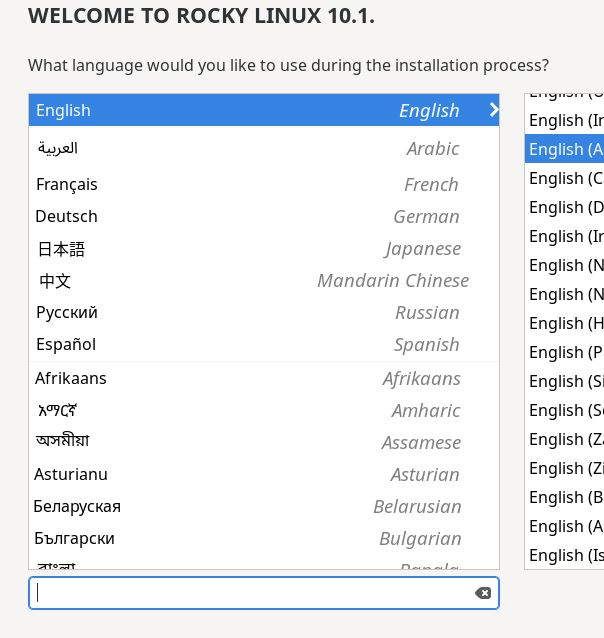
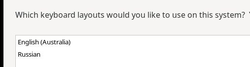
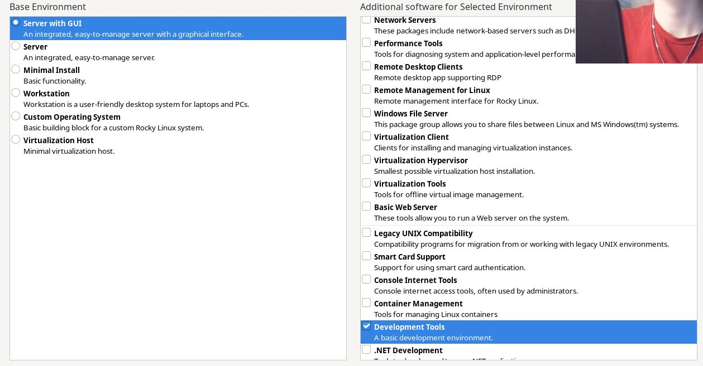
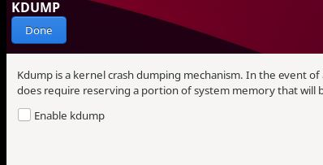

---
## Front matter
lang: ru-RU
title: Операционные системы
subtitle: Установка и конфигурация ОС на виртуальную машину
author:
  - Серебрякова Дарья Ильинична
institute:
  - Российский университет дружбы народов, Москва, Россия
date: 17 февраля

## i18n babel
babel-lang: russian
babel-otherlangs: english

## Formatting pdf
toc: false
toc-title: Содержание
slide_level: 2
aspectratio: 169
section-titles: true
theme: Madrid
---

# Цель работы

Целью данной работы является приобретение практических навыков установки операционной системы на виртуальную машину, настройки минимально необходимых для дальнейшей работы сервисов.

# Задание

1.Запуск VirtualBox и создание новой виртуальной машины (операционная система Linux, Fedora).
2.Настройка установки ОС.
3.Перезапуск виртуальной машины и установка драйверов для VirtualBox.
4.Подключение образа диска дополнений гостевой ОС.
5.Установка необходимого ПО для создания документации.
6.Выполнение домашнего задания.

# Теоретическое введение

Операционная система - это комплекс взаимосвязанных программ, который действует как интерфейс между приложениями и пользователями с одной стороны и аппаратурой компьютера с другой стороны. VirtualBox - это специальное средство для виртуализации, позволяющее запускать операционную систему внтури другой. С помощью VirtualBox мы можем также настраивать сеть, обмениваться файлами и делать многое другое.

# Выполнение лабораторной работы

## Создание виртуальной машины

Установила Rocky Linux и задала необходимые параметры в виде памяти, количества ядер и тд. Запустила виртуальную машину и выбрала язык интерфейса (рис. 1).

{#fig:001 width=70%}

##

Добавляю русскую раскадку и устанавливаю клавиши для переключения (рис. 2).

{#fig:002 width=70%}

##

В разделе выбора программ указала в качестве базового окружения Server with GUI , а в качестве дополнения — Development Tools (рис. 3).

{#fig:003 width=70%}

##

Отключфю KDUMP (рис. 4).

{#fig:004 width=70%}

# Создание учетной записи и пользователя

Задаю имя пользователя (рис. 5).

{#fig:005 width=70%}

##

Задаю пользователя с правами администратора и устанавливаю пароль (рис. 6).

{#fig:006 width=70%}

##

Перезапускаю виртуальную машину и вхожу в свою учетную запись (рис. 7).

{#fig:007 width=70%}

##

Установила имя пользователя и имя хоста (рис. 8).

{#fig:008 width=70%}

# Контрольные вопросы

1) Какую информацию содержит учетная запись пользователя?

Имя пользователя, зашифрованный пароль пользователя, индентификационный номер пользователя, индентификационный номер группы пользователя, домашний каталог пользователя, командный интерпретатор пользователя.

##

2) Укажите команды терминала и приведите примеры: 
-для получения справки по команде: man <назввание команды> man cd
-ддя перемещения по файловой системе: cd cd ~/Downloads
-для просмотра содержимого каталога: ls ls ~/Downloads
-для определения объема каталога: du <имя каталога> du Downloads
-для создания каталогов: mkdir <имя каталога> mkdir ~/Downloads/New
-для создания файлов: touch <имя файла> touch retouch
-для удаления каталогов: rm <имя каталога> rm dir1
-для удаления файлов: rm -r <имя файла> rm -r text.txt
-для задания определенных прав на файл или каталог: chmod + x <имя каталога или файла> chmod +x text.txt
-для просмотра истории команд: history

##

3) Что такое файловая система? Приведите примеры с краткой характеристикой.

Файловая система - это часть операционной системы, назначение которой состоит в том, чтобы обеспечить пользователю удобный интерфейс при работе с данными, хранящимися на диске, и обеспечить совместное использование файлов несколькими пользователями и процессорами.
Примеры файловых систем: 
Ext2, Ext3, Ext4 или Extended Felisystem - стандартная файловая система для Linux.
NTFS (New Technology File System):  Стандартная файловая система для Windows.

##

4) Как посмотреть, какие файловые системы подмонтированы в ОС?

С помощью команды mount

##

5) Как удалить зависший процесс?

С помощью команды kill.

# Выводы

В результате выполнения лабораторной работы мы приобрели навыки установки операционной системы на виртуальную машину, а также настройки минимально необходимых для дальнейшей работы сервисов.

