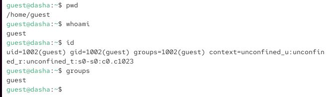
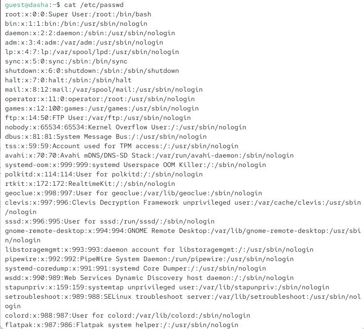
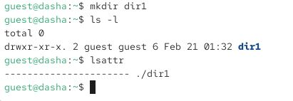
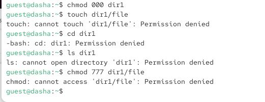

---
## Front matter
title: "Отчёт по лабораторной работе 2"
subtitle: "Дискреционное разграничение прав в Linux. Основные атрибуты"
author: "Серебрякова Дарья Ильинична"

## Generic otions
lang: ru-RU
toc-title: "Содержание"

## Bibliography

## Pdf output format
toc: true # Table of contents
toc-depth: 2
lof: true # List of figures
lot: true # List of tables
fontsize: 12pt
linestretch: 1.5
papersize: a4
documentclass: scrreprt
## I18n polyglossia
polyglossia-lang:
  name: russian
  options:
	- spelling=modern
	- babelshorthands=true
polyglossia-otherlangs:
  name: english
## I18n babel
babel-lang: russian
babel-otherlangs: english
## Fonts
mainfont: IBM Plex Serif
romanfont: IBM Plex Serif
sansfont: IBM Plex Sans
monofont: IBM Plex Mono
mathfont: STIX Two Math
mainfontoptions: Ligatures=Common,Ligatures=TeX,Scale=0.94
romanfontoptions: Ligatures=Common,Ligatures=TeX,Scale=0.94
sansfontoptions: Ligatures=Common,Ligatures=TeX,Scale=MatchLowercase,Scale=0.94
monofontoptions: Scale=MatchLowercase,Scale=0.94,FakeStretch=0.9
mathfontoptions:
## Biblatex
  - parentracker=true
  - backend=biber
  - hyperref=auto
  - language=auto
  - autolang=other*
  - citestyle=gost-numeric
## Pandoc-crossref LaTeX customization
figureTitle: "Рис."
tableTitle: "Таблица"
listingTitle: "Листинг"
lofTitle: "Список иллюстраций"
lotTitle: "Список таблиц"
lolTitle: "Листинги"
## Misc options
indent: true
header-includes:
  - \usepackage{indentfirst}
  - \usepackage{float} # keep figures where there are in the text
  - \floatplacement{figure}{H} # keep figures where there are in the text
---

# Цель работы

Получение практических навыков работы в консоли с атрибутами файлов, закрепление теоретических основ дискреционного разграничения доступа в современных системах с открытым кодом на базе ОС Linux

# Выполнение лабораторной работы

Создаю учетную запись пользователя guest, задаю пароль и вхожу в систему под этим пользователем (рис. 1).

{#fig:001 width=70%}

Определяю директорию, в которой нахожусь, уточняю имя пользователя и его группы (рис. 2).

{#fig:002 width=70%}

Просматриваю файл со своей учетной записью (рис. 3).

{#fig:003 width=70%}

Выясняю, что мой uid = 0, gid = 0 (рис. 4).

{#fig:004 width=70%}

Определяю существующие в системе директории и проверяю, какие расширенные атрибуты установлены на поддиректориях (рис. 5).

{#fig:005 width=70%}

Создаю в домашней директории поддиректорию dir1, определяю какие права доступа и расширенные атрибуты были выставлены на директорию  (рис. 6).

{#fig:006 width=70%}

Снимаю с директории все атрибуты  (рис. 7).

{#fig:007 width=70%}

Пытаюст создать в директории dir1 файл file1  (рис. 8).

{#fig:008 width=70%}

Выполняю действия, необходимые для заполнения таблицы  (рис. 9).

{#fig:009 width=70%}

# Выводы

Получила практические навыки работы в консоли с атрибутами файлов, закрепила теоретические основы дискреционного разграничения доступа в современных системах с открытым кодом на базе ОС Linux

