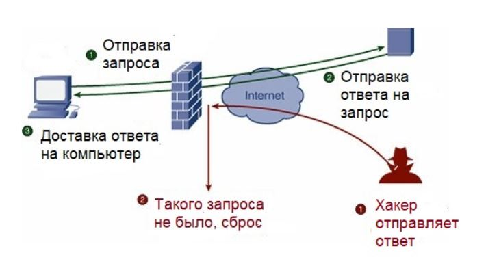

---
## Author
author:
  name: Серебрякова Дарья Ильинична
  degrees: DSc
  orcid: 0000-0002-0877-7063
  email: 1132246733@rudn.ru
  affiliation:
    - name: Российский университет дружбы народов
      country: Российская Федерация
      postal-code: 117198
      city: Москва
      address: ул. Миклухо-Маклая, д. 21к3
## Title
title: Межсетевые экраны
subtitle: Доклад
license: CC BY
date: today
date-format: "YYYY-MM-DD" # Example: 2025-09-06
slide_level: 2
---

# Информация

## Докладчик

:::::::::::::: {.columns align=center}
::: {.column width="70%"}

  * Серебрякова Дарья Ильинична
  * стедентка НКАбд-04-24
  * Российский университет дружбы народов им. П. Лумумбы
  * [1132246733@rudn.ru](mailto:1132246733@rudn.ru)
  * <https://github.com/dserebryakova/study_2025-2026_infosec-intro>

:::
::: {.column width="30%"}

:::
::::::::::::::

# Вступительная часть

## Актуальность

В современном мире растет число киберугроз. Межсетевые экраны остаются актуальными, так как являются первой линией защиты.

## Цели и задачи

**Цель:** Изучение темы межсетевых экранов

**Задачи:**

- Узнать, что такое межсетевой экран, для чего он нужен 

- Определить типы и классификации межсетевых экранов 

- Разобрать принцип работы межсетевых экранов 

- Понять, кому и для чего требуется МЭ 

- Рассмотреть варианты приобретения МЭ 

# Основная часть

## Что такое межсетевой экран?

Межсетевой экран - это программно-аппаратный или программный комплекс, который отслеживает сетевые пакеты, блокирует или разрешает их прохождение.

{#fig:001 width=70%}

## Задачи МЭ

- фильтровать входящий и исходящий трафик по заданным правилам;

- блокировать подозрительные соединения до того, как они доберутся до хостов;

- вести журнал сетевых событий для последующего разбора инцидентов;

- ограничивать доступ между сегментами сети.

## Принцип работы

 - сверяет заголовки с набором ACL-правил (IP-адрес, порт, протокол);
 
 - проверяет состояние соединения — новое оно, установленное или связанное с уже открытой сессией (stateful inspection);
 
 - применяет политики для разных зон и групп пользователей;
 
 - при срабатывании правила — логирует событие и (если настроено) шлёт алерт администратору через SNMP, syslog или webhook в мессенджер.

## Фильтрация трафика

{#fig:001 width=70%}

## Классификация МЭ

 - по сетевым возможностям;
 
 - по видимости пакетов;
 
 - по методам фильтрации;
 
 - по архитектуре;

 - отдельно выделяются прокси-серверы.
 
## Кому и зачем нужен МЭ
 
 - Компаниям, хранящим персональные данные
 
 - Компаниям, работающим с гостайной
 
## Цены на МЭ
 
 - Бесплатные 
 
 - 50 000–300 000 руб.
 
 - 300 000–2 000 000 руб.
 
 - 2 000 000+ руб.
 
# Заключение
 
## Вывод

Средства защиты сетевого периметра играют важную роль в обеспечении безопасности как корпоративных, так и государственных сетей. В данном исследовании я рассмотрела основные типы таких решений, их функции и особенности. Правильный выбор технологии помогает создать надежную защиту данных, предотвратить утечки информации и поддерживать стабильную работу сети.

## Список литературы{.unnumbered}

1. Кулябов Д.С., Королькова А.В. Информационная безопасность: учебное пособие. — М.: РУДН, 2024. — 180 с.

2. Академия Selectel. Введение в сетевую безовасность. URL: https://selectel.ru/blog/firewall/ 

3. Блог Ittelo. Для чего нужен межсетевой экран и как работает. URL: https://www.ittelo.ru/news/dlya-chego-nuzhen-mezhsetevoy-ekran-i-kak-rabotaet/

4. VK Icloud/Security. URL: https://cloud.vk.com/blog/mezhsetevoj-ekran-pochemu-on-doljen-byt-sertificirovan-fstek/ 
