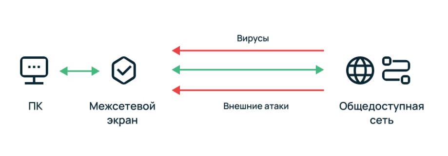

---
## Author
author:
  name: Серебрякова Дарья Ильинична
  degrees: DSc
  orcid: 0000-0002-0877-7063
  email: 1132246733@rudn.ru
  affiliation:
    - name: Российский университет дружбы народов
      country: Российская Федерация
      postal-code: 117198
      city: Москва
      address: ул. Миклухо-Маклая, д. 21к3

## Title
title: "Межсетевые экраны"
subtitle: "Доклад"
license: "CC BY"
---

# Вводная часть

## Актуальность темы

Межсетевые экраны остаются актуальными в современном мире благодаря росту киберугроз. Они играют центральную роль в обеспечении безопасности, предотвращая несанкционированный доступ, фильтруя трафик и блокируя вредоносные атаки.
   - 80% атак приходятся на сетевой периметр
   - Межсетевой экран — первая линия защиты

## Цели и задачи

**Цель:** Изучение темы межсетевых экранов

**Задачи:**

- Узнать, что такое межсетевой экран, для чего он нужен 

- Определить типы и классификации межсетевых экранов 

- Разобрать принцип работы межсетевых экранов 

- Понять, кому и для чего требуется МЭ 

- Рассмотреть варианты приобретения МЭ 

# Знакомство с межсетевыми экранами

## Что такое межсетевой экран?

Межсетевой экран (МЭ, брандмауэр или Firewall) представляет собой программно-аппаратный или программный комплекс, который отслеживает сетевые пакеты, блокирует или разрешает их прохождение. В фильтрации трафика брандмауэр опирается на установленные параметры — чаще всего их называют правилами МЭ. 

Современные межсетевые экраны располагаются на периферии сети, ограничивают транзит трафика, установку нежелательных соединений и подобные действия за счет средств фильтрации и аутентификации (рис. 1).

{#fig:001 width=70%}

## Задачи МЭ

- фильтровать входящий и исходящий трафик по заданным правилам;

- блокировать подозрительные соединения до того, как они доберутся до хостов;

- вести журнал сетевых событий для последующего разбора инцидентов;

- ограничивать доступ между сегментами сети.

## Принцип работы

У файрвола два базовых режима: «запрещено всё, что не разрешено» (whitelist) и «разрешено всё, что не запрещено» (blacklist). Первый — параноидальный и безопасный, второй — удобный и дырявый. Чаще всего используется whitelist-подход.

Действия при обработке каждого пакета:

 - сверяет заголовки с набором ACL-правил (IP-адрес, порт, протокол);
 
 - проверяет состояние соединения — новое оно, установленное или связанное с уже открытой сессией (stateful inspection);
 
 - применяет политики для разных зон и групп пользователей;
 
 - при срабатывании правила — логирует событие и (если настроено) шлёт алерт администратору через SNMP, syslog или webhook в мессенджер.
 
## Типы МЭ

 - Пакетный фильтр (Packet Filter) — смотрит только заголовки: IP-адрес источника/назначения, порт, протокол. Быстрый, но «слепой» к содержимому.
 
 - Stateful Inspection — отслеживает состояние TCP-сессий. Знает, какой пакет относится к какому соединению, и не пропустит пакет с флагом ACK без предшествующего SYN.
 
 - Application-Level Gateway (прокси-файрвол) — работает на L7, разбирает протоколы прикладного уровня (HTTP, DNS, SMTP). Может заглянуть внутрь запроса и заблокировать, скажем, SQL-инъекцию в URL.
 
 - NGFW (Next-Generation Firewall) — комбинирует stateful inspection, DPI, IPS, контроль приложений и идентификацию пользователей в одном устройстве. Palo Alto, Fortinet FortiGate, Check Point — типичные представители. Сюда же относят и встроенный анализ зашифрованного трафика (TLS-инспекция).
 
## Фильтрация трафика

Фильтрация — ядро работы любого файрвола. Каждый пакет проходит через цепочку правил (rule chain), и первое совпавшее правило определяет его судьбу: пропустить (ACCEPT), отбросить молча (DROP) или отклонить с уведомлением (REJECT).

Два подхода к построению правил:

 - Default Deny — всё заблокировано, кроме явно разрешённого. Безопасно, но требует тщательной проработки ACL. Одна забытая запись — и пользователи не могут подключиться к нужному сервису.
 
 - Default Allow — всё разрешено, кроме явно запрещённого.
 
## Классификация МЭ

Брандмауэры делятся по ряду признаков и параметрам:

 - по сетевым возможностям — работают на уровне IP-адресов либо анализируют информацию на уровнях L3–L7 модели OSI;
 
 - по видимости пакетов — способны выполнять только поверхностный анализ заголовков или просматривать и анализировать содержимое;
 
 - по методам фильтрации — разрешают, отклоняют или отбрасывают;
 
 - по архитектуре — аппаратные и программные.

Отдельно выделяются прокси-серверы, которые следят за входящим и исходящим сетевым трафиком, обеспечивают анонимность пользователей и защиту локальной сети.

## Реализация

Три формата развёртывания файрвола:
 
 - Аппаратный (appliance) — выделенное устройство, заточенное под обработку трафика. Работает на собственной ОС (FortiOS, PAN-OS, Gaia), имеет аппаратные ускорители для DPI и TLS-инспекции.
 
 - Программный — pfSense, OPNsense, iptables/nftables, Windows Firewall. Ставится на обычный сервер или выделенную виртуалку. Гибкость настройки отличная, но производительность упирается в CPU и сетевой стек ОС.
 
 - Виртуальный / облачный — тот же программный файрвол, но упакованный в VM-образ или контейнер. NSX Distributed Firewall от VMware, виртуальные аплайнсы FortiGate-VM, Palo Alto VM-Series. В Kubernetes-кластерах эту роль частично берут на себя Network Policies и сервис-меши типа Istio.
 
Гибридные среды (on-prem + облако) часто комбинируют аппаратный МЭ на периметре и виртуальные инстансы внутри облачных VPC.

## Кому и зачем нужен МЭ

Если компания хранит персональные данные, то, согласно 152-ФЗ, она обязана обеспечить им защиту. Чтобы защищать данные в соответствии с требованиями закона, компании нужно использовать средства защиты, сертифицированные ФСТЭК. Такой сертификат подтверждает, что программа или устройство действительно надежно защищает данные. ФСТЭК сертифицирует в том числе межсетевые экраны — как программные, так и аппаратные.

То есть, если вы храните в базах данных информацию о своих сотрудниках или клиентах, вы работаете с персональными данными, а значит, обязаны обеспечить им защиту. Иногда это подразумевает, что нужно задействовать сертифицированный ФСТЭК межсетевой экран.

Если вы не храните гостайну или персональные данные, необязательно устанавливать именно сертифицированный ФСТЭК межсетевой экран. Но если вы заботитесь о секретности ваших данных, при выборе экрана имеет смысл обратить внимание на сертификат — он подтвердит, что выбранный МЭ действительно надежный.

## Цены на МЭ

 - Бесплатно: pfSense, OPNsense, iptables/nftables. Нужен только сервер с парой сетевых интерфейсов и работа администратора.
 
 - 50 000–300 000 руб.: младшие аппаратные модели для малого бизнеса (Fortinet FortiGate 40F/60F, Zyxel USG FLEX). Пропускная способность — 1–5 Гбит/с, базовый набор NGFW-функций.
 
 - 300 000–2 000 000 руб.: средний сегмент для филиальных сетей и SMB. Fortinet FortiGate 100–400 серий, Check Point Quantum Spark.
 
 - 2 000 000+ руб.: enterprise-решения для ЦОД и крупных распределённых сетей. Шасси Palo Alto PA-5000/PA-7000, Fortinet FortiGate 3000–7000, Check Point Quantum Maestro.

К стоимости нужно добавить ежегодные подписки на security-сервисы — они составляют 20–40% от цены устройства
 
# Выводы

В ходе исследования я изучила тему межсетевых экранов. Узнала, какие они бывают, как работают и кому необходимы к установке

# Список литературы{.unnumbered}

1. Кулябов Д.С., Королькова А.В. Информационная безопасность: учебное пособие. — М.: РУДН, 2024. — 180 с.

2. Академия Selectel. Введение в сетевую безовасность. URL: https://selectel.ru/blog/firewall/ 

3. Блог Ittelo. Для чего нужен межсетевой экран и как работает. URL: https://www.ittelo.ru/news/dlya-chego-nuzhen-mezhsetevoy-ekran-i-kak-rabotaet/

4. VK Icloud/Security. URL: https://cloud.vk.com/blog/mezhsetevoj-ekran-pochemu-on-doljen-byt-sertificirovan-fstek/ 

::: {#refs}
:::
